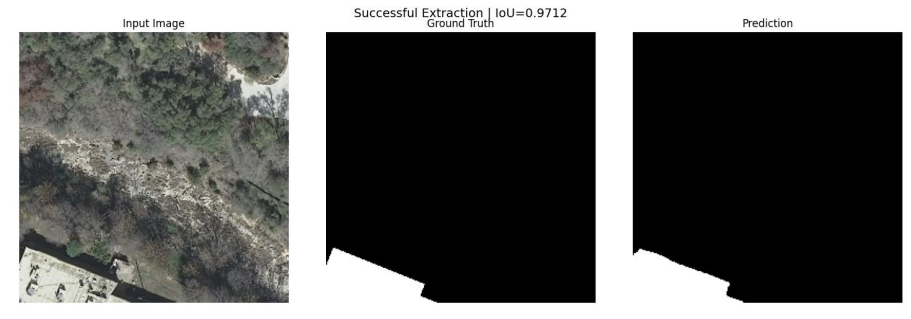
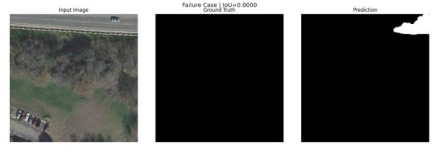

# Building Footprint Segmentation from High-Resolution Aerial Imagery
A deep learning-based building footprint segmentation project using the INRIA Aerial Image Labeling Dataset. The project implements a U-Net architecture with BCE + Dice loss to segment buildings from high-resolution aerial RGB imagery.

---

## Overview

Building footprint extraction from aerial imagery is a challenging binary semantic segmentation problem because buildings vary substantially in size, shape, color, density, and surrounding context.

The main challenges addressed in this project are:

* Preventing spatial/geographic data leakage between training and validation data
* Preserving fine building boundaries during segmentation
* Handling the imbalance between building and background pixels
* Detecting both small and large building structures
* Evaluating segmentation beyond simple pixel accuracy
* Understanding model behavior through qualitative and size-based error analysis

The complete workflow is implemented in **PyTorch**.

---

## Dataset

The project uses the **INRIA Aerial Image Labeling Dataset**.

The dataset contains high-resolution aerial imagery from five geographic regions:

* Austin
* Chicago
* Kitsap
* Western Tyrol
* Vienna

Each training tile has:

* Image size: **5000 × 5000 pixels**
* Spatial resolution: **0.3 m/pixel**
* Image channels: **RGB**
* Ground-truth mask: binary building/non-building mask

At 0.3 m/pixel, each tile represents approximately:

**1500 m × 1500 m**

The ground-truth masks identify building footprints as foreground and non-building areas as background.

### Dataset structure

```text
AerialImageDataset/
├── train/
│   ├── images/
│   └── gt/
│
└── test/
    └── images/
```

---

## Project Workflow

The complete workflow follows:

```text
INRIA Aerial Image Dataset
            │
            ▼
     Dataset Inspection
            │
            ▼
      Spatial Tile Split
            │
            ├── Training tiles
            └── Validation tiles
            │
            ▼
       Random 256×256
          Patches
            │
            ▼
       Preprocessing
       RGB / 255
       Mask → {0,1}
            │
            ▼
          U-Net
            │
            ▼
      BCE + Dice Loss
            │
            ▼
        Adam Optimizer
            │
            ▼
     Best IoU Checkpoint
            │
            ▼
      Quantitative Metrics
            │
            ├── IoU
            ├── Dice/F1
            ├── Precision
            └── Recall
            │
            ▼
     Qualitative Analysis
            │
            ├── Successful cases
            └── Failure cases
            │
            ▼
      Building Size Analysis
```

---

# 1. Dataset Inspection and Preprocessing

The first stage verifies the image-mask pairs and inspects the characteristics of the aerial imagery and ground-truth masks.

The RGB images are converted from the original 8-bit range:

```text
0–255
```

to:

```text
0–1
```

using:

```python
image = image / 255.0
```

The ground-truth masks are converted to binary values:

```text
0 → background
1 → building
```

This representation is used throughout training and evaluation.

---

## 2. Spatial Data Partitioning

Spatial leakage is particularly important in aerial-image segmentation.

Randomly splitting patches from the same geographic tile could allow highly similar neighboring regions to appear in both training and validation data. This would make the validation result less representative of performance on unseen geographic areas.

Therefore, the split is performed **before patch extraction**.

For each geographic region:

```text
36 available tiles
        │
        ├── Tiles 1–5  → Validation
        │
        └── Tiles 6–15 → Training
```

The implemented development subset therefore contains:

| Region        | Training tiles | Validation tiles |
| ------------- | -------------: | ---------------: |
| Austin        |             10 |                5 |
| Chicago       |             10 |                5 |
| Kitsap        |             10 |                5 |
| Western Tyrol |             10 |                5 |
| Vienna        |             10 |                5 |
| **Total**     |         **50** |           **25** |

The remaining dataset tiles are not used in this development experiment.

This produces complete tile-level separation between training and validation data.

<p align="center">
  
</p>

<p align="center">
  <strong>Figure 1: A sample aerial view of the building footprint and surrounding layout. </strong>
</p>
---

# 3. Patch Extraction

The original 5000×5000 tiles are too large to process directly within the available computational budget.

Therefore, the images are divided into smaller training samples.

The selected patch size is:

```text
256 × 256 pixels
```

At 0.3 m/pixel, a 256×256 patch represents approximately:

```text
76.8 m × 76.8 m
```

Random patches are extracted independently from the already separated training and validation tiles.

The experiment uses:

```text
50 patches per tile
```

which produces:

```text
50 training tiles × 50 patches = 5000 training patches

25 validation tiles × 50 patches = 2500 validation patches
```

Most importantly, patches are generated **after** the tile-level split, so no validation patch originates from a training tile.

---

## 4. Patch Preprocessing

Each image patch is converted from:

```text
H × W × C
```

to the PyTorch format:

```text
C × H × W
```

with:

```text
3 × 256 × 256
```

The masks are converted to:

```text
1 × 256 × 256
```

The preprocessing pipeline is:

```text
RGB TIFF
   ↓
256 × 256 crop
   ↓
float32 conversion
   ↓
divide by 255
   ↓
CHW tensor
```

For the mask:

```text
Ground-truth TIFF
       ↓
binary conversion
       ↓
0 = background
1 = building
       ↓
tensor
```

<p align="center">
  
</p>

<p align="center">
  <strong>Figure 2 — Full aerial tile (left) and corresponding binary building mask (right) prior to patch extraction. </strong>
</p>

---

# 5. Why U-Net?

The final segmentation architecture is a **U-Net-style encoder-decoder network**.

The main reason for using U-Net is the spatial nature of the task.

Building segmentation requires both:

1. **High-level semantic information**
   to distinguish buildings from roads, vegetation, parking areas, and other visually similar surfaces.

2. **Fine spatial information**
   to accurately recover building boundaries and small structures.

The U-Net architecture addresses this using encoder-decoder processing together with **skip connections** between corresponding encoder and decoder levels.

The skip connections allow fine-grained spatial information from earlier encoder stages to be transferred directly to the decoder.

This is particularly relevant for building footprints, where boundary localization is important.

---

# 6. U-Net Architecture

The implemented U-Net contains four encoder levels followed by a bottleneck and four decoder levels.

### Encoder

```text
Input
  │
  ▼
DoubleConv
3 → 64
  │
MaxPool
  │
  ▼
DoubleConv
64 → 128
  │
MaxPool
  │
  ▼
DoubleConv
128 → 256
  │
MaxPool
  │
  ▼
DoubleConv
256 → 512
  │
MaxPool
```

### Bottleneck

```text
DoubleConv
512 → 1024
```

### Decoder

The decoder progressively restores spatial resolution using transposed convolutions.

```text
1024 → 512
512  → 256
256  → 128
128  → 64
```

At every decoder stage, the upsampled features are concatenated with the corresponding encoder features through skip connections.

Finally:

```text
64 → 1
```

using a 1×1 convolution.

The final output is a single-channel logit map representing the building probability before sigmoid activation.

---

## U-Net Building Blocks

Each convolutional block consists of:

```text
3×3 Convolution
      ↓
Batch Normalization
      ↓
ReLU
      ↓
3×3 Convolution
      ↓
Batch Normalization
      ↓
ReLU
```

This structure is used throughout the encoder and decoder.


# 7. Loss Function

The task has a strong foreground/background imbalance because building pixels occupy a smaller portion of the aerial scenes.

Using only a standard pixel-wise loss can make optimization strongly influenced by the majority background class.

Therefore, the implemented objective combines:

```text
BCE Loss + Dice Loss
```

---

## Binary Cross-Entropy

Binary Cross-Entropy evaluates the prediction at the individual pixel level.

It provides stable pixel-wise supervision and encourages correct classification of building and background pixels.

The implementation uses:

```python
nn.BCEWithLogitsLoss()
```

which combines the sigmoid operation and binary cross-entropy calculation in a numerically stable form.

---

## Dice Loss

Dice loss focuses directly on the overlap between the predicted building region and the ground-truth building region.

The Dice coefficient is:

```text
Dice = 2TP / (2TP + FP + FN)
```

and the corresponding loss is:

```text
Dice Loss = 1 − Dice
```

Dice is less sensitive to class imbalance than a purely pixel-wise objective.

---

## Combined Objective

The final loss is:

```text
Total Loss = BCE Loss + Dice Loss
```

This combines:

* pixel-level classification from BCE
* region-overlap optimization from Dice

The combination was selected to address the binary segmentation setting and the imbalance between building and background pixels.

---

# 8. Training Configuration

The model is trained using the Adam optimizer.

| Parameter               |     Value |
| ----------------------- | --------: |
| Optimizer               |      Adam |
| Learning rate           |    0.0001 |
| Batch size              |        16 |
| Maximum epochs          |        25 |
| Early stopping patience |         5 |
| Patch size              | 256 × 256 |
| Input channels          |         3 |
| Output channels         |         1 |
| Prediction threshold    |       0.5 |

Validation IoU is monitored during training.

Whenever validation IoU improves, the model checkpoint is saved.

This ensures that the final evaluation uses the model corresponding to the best observed validation IoU rather than automatically using the final training epoch.

The best validation IoU was obtained at:

```text
Epoch 23
Validation IoU = 0.6293
```

<p align="center">
  
</p>

<p align="center">
  <strong>Figure 3 — Training/validation loss and validation IoU across epochs. </strong>
</p>

# 9. Evaluation Metrics

Pixel accuracy alone is not sufficient for this problem because background pixels dominate the images.

Therefore, four segmentation metrics are reported:

### Intersection over Union (IoU)

```text
IoU = TP / (TP + FP + FN)
```

IoU measures the overlap between predicted and ground-truth building regions.

### Dice / F1 Score

```text
Dice = 2TP / (2TP + FP + FN)
```

Dice measures the similarity between predicted and ground-truth regions.

### Precision

```text
Precision = TP / (TP + FP)
```

Precision measures how many pixels predicted as buildings are actually buildings.

### Recall

```text
Recall = TP / (TP + FN)
```

Recall measures how many actual building pixels are detected.

---

# 10. Overall Results

The final model achieved the following validation performance:

| Metric        |      Score |
| ------------- | ---------: |
| **IoU**       | **0.6293** |
| **Dice / F1** | **0.7610** |
| **Precision** | **0.7911** |
| **Recall**    | **0.7451** |

The results show reasonably strong overlap between the predicted and ground-truth building regions.

The precision being higher than recall indicates that the final model is somewhat conservative in its building predictions: it avoids many false-positive predictions but misses a portion of actual building pixels.

---

## 11. Training Progress

The validation IoU improved throughout training and reached its highest recorded value at epoch 23.

Selected validation IoU values:

|  Epoch | Validation IoU |
| -----: | -------------: |
|      1 |         0.4850 |
|      5 |         0.5528 |
|      8 |         0.5772 |
|     12 |         0.5979 |
|     15 |         0.6083 |
|     17 |         0.6098 |
|     20 |         0.6154 |
|     21 |         0.6237 |
| **23** |     **0.6293** |
|     25 |         0.6243 |

The best checkpoint was therefore retained from epoch 23.

---

# 12. Building-Size Analysis

Building detection performance was also analyzed according to the physical footprint area of connected building components.

At 0.3 m/pixel:

```text
1 pixel = 0.09 m²
```

Building components were grouped into seven physical-area categories.

For each ground-truth building component, the fraction of its pixels recovered by the predicted mask was calculated.

A component was considered detected when at least **50% of its ground-truth pixels** were recovered.

### Results

| Building area | Detection recall |
| ------------- | ---------------: |
| <25 m²        |           29.95% |
| 25–50 m²      |           67.22% |
| 50–100 m²     |           83.02% |
| 100–250 m²    |           87.94% |
| 250–500 m²    |           89.98% |
| 500–1000 m²   |           92.00% |
| >1000 m²      |           92.26% |

<p align="center">
  
</p>

<p align="center">
  <strong>Figure 4 —  Building detection recall by physical footprint area. </strong>
</p>

### Interpretation

The results show a strong relationship between building size and detection reliability.

Very small structures are substantially more difficult to detect:

```text
<25 m² → 29.95%
```

whereas larger structures are detected much more reliably:

```text
>1000 m² → 92.26%
```

This behavior is consistent with the fact that small buildings occupy fewer pixels and provide less spatial and structural information to the segmentation network.

The size analysis therefore identifies **small-building detection as the main remaining weakness of the model**.

---

# 13. Coarse Building-Size Analysis

A second analysis grouped validation patches according to the largest connected building component present in each patch.

The resulting mean IoU was:

| Category | Mean IoU |
| -------- | -------: |
| Small    |   0.1913 |
| Medium   |   0.5568 |
| Large    |   0.6960 |

This provides the same overall conclusion as the finer-grained object-level analysis:

> Segmentation quality increases substantially as building size increases.

---

# 14. Qualitative Error Analysis

Qualitative evaluation compares three views:

```text
Input aerial image
        │
        ├── Ground-truth mask
        │
        └── Predicted mask
```

The validation patches are ranked according to IoU.

The highest- and lowest-scoring patches are then visualized to examine successful predictions and failure cases.

<p align="center">
  
</p>

<p align="center">
  <strong>Figure 5 —   Best-performing validation patch (IoU = 0.9712). </strong>
</p>

### Successful extraction

The best-performing validation patch achieved:

```text
IoU = 0.9712
```

The prediction closely follows the ground-truth building footprint.

High-quality predictions are generally associated with buildings that:

* have clear visual boundaries
* occupy a relatively large contiguous region
* have stronger contrast against surrounding areas

---

<p align="center">
  
</p>

<p align="center">
  <strong>Figure 6 —   Worst-scoring validation patch (IoU = 0.0) </strong>
</p>

### Failure case

The lowest-scoring validation patch had:

```text
IoU = 0.0
```

However, this particular patch contained no building pixels in either the ground truth or prediction.

Therefore, the zero IoU does not necessarily represent a meaningful segmentation failure. It illustrates a limitation of applying foreground IoU directly to completely background patches.

For this reason, qualitative interpretation is important alongside numerical metrics.

---

# 15. Key Findings

The experiment leads to several important observations.

### 1. Spatial partitioning is important

Splitting the data at the tile level before extracting patches prevents training and validation samples from coming from the same geographic tile.

### 2. U-Net is suitable for footprint segmentation

The encoder captures increasingly high-level contextual features, while skip connections allow the decoder to recover fine spatial information.

### 3. BCE + Dice provides a suitable segmentation objective

BCE provides pixel-level supervision while Dice directly optimizes region overlap and reduces sensitivity to foreground/background imbalance.

### 4. Overall segmentation quality is reasonable

The final model achieved:

```text
IoU      = 0.6293
Dice     = 0.7610
Precision = 0.7911
Recall    = 0.7451
```

### 5. Small buildings remain the main challenge

Detection recall increases from:

```text
29.95% for <25 m²
```

to:

```text
92.26% for >1000 m²
```

Therefore, improving small-structure representation is the clearest direction for future work.

### 6. Qualitative analysis complements aggregate metrics

The best prediction demonstrates that the model can closely reproduce clear building footprints, while difficult cases reveal limitations that cannot be understood from a single aggregate score.

---

# 16. Reproducibility

The experiment uses a fixed random seed:

```python
SEED = 42
```

The training and validation tiles are selected using deterministic tile numbering within each geographic region.

The main training configuration is explicitly defined in the notebook:

```text
Patch size       : 256 × 256
Training tiles   : 50
Validation tiles : 25
Patches/tile     : 50
Training patches : 5000
Validation patches: 2500
Batch size       : 16
Learning rate    : 1e-4
Optimizer        : Adam
Loss             : BCE + Dice
Maximum epochs   : 25
Early stopping   : patience 5
Best metric      : Validation IoU
Threshold        : 0.5
```

---

# 17. Repository Structure

A recommended repository structure is:

```text
building-footprint-segmentation/
│
├── README.md
│
├── notebooks/
│   └── part-02-coding-aritra-sarkar.ipynb
│
├── models/
│   └── best_unet.pth
│
├── figures/
│   ├── spatial_tile_split.png
│   ├── patch_preprocessing.png
│   ├── unet_architecture.png
│   ├── training_validation_curves.png
│   ├── building_size_recall.png
│   ├── qualitative_best_prediction.png
│   └── qualitative_failure_case.png
│
└── results/
    └── validation_results.csv
```

The original INRIA dataset is **not included in this repository**. Users should obtain the dataset separately and configure the notebook with the appropriate dataset path.

---

# 18. Requirements

The implementation uses Python and PyTorch.

Main dependencies include:

```text
Python
NumPy
Pandas
Matplotlib
Pillow
PyTorch
Torchvision
SciPy
scikit-learn
KaggleHub
```

A CUDA-capable GPU is recommended for practical training time.

---

# 19. How to Run

### 1. Obtain the dataset

Download the INRIA Aerial Image Labeling Dataset.

### 2. Open the notebook

```text
notebooks/part-02-coding-aritra-sarkar.ipynb
```

### 3. Configure the dataset path

The notebook uses KaggleHub to obtain the dataset:

```python
import kagglehub

dataset_path = kagglehub.dataset_download(
    "sagar100rathod/inria-aerial-image-labeling-dataset"
)
```

### 4. Run the notebook sequentially

The notebook performs:

```text
Dataset loading
        ↓
EDA
        ↓
Spatial split
        ↓
Patch extraction
        ↓
Dataset/DataLoader creation
        ↓
U-Net construction
        ↓
BCE + Dice loss
        ↓
Training
        ↓
Best checkpoint selection
        ↓
Quantitative evaluation
        ↓
Qualitative analysis
        ↓
Building-size analysis
```

---

# 20. Limitations and Future Work

The current experiment was designed as a reproducible development-scale segmentation study rather than a full-scale deployment system.

Potential future improvements include:

* Training on a larger portion of the INRIA dataset
* Increasing the number of training tiles
* Data augmentation
* Multi-scale feature extraction
* Architectures specifically designed for small-object segmentation
* More advanced boundary-aware objectives
* Improved handling of very small building footprints
* Evaluation on the official hidden test set

The current results indicate that **small-building detection is the most important area for further improvement**.

---

# 21. Conclusion

This project develops an end-to-end building footprint segmentation pipeline using high-resolution aerial imagery.

The workflow emphasizes **spatially separated evaluation, architecture selection based on the spatial requirements of building footprints, combined BCE and Dice optimization, and analysis beyond overall pixel accuracy**.

The final U-Net model achieved:

```text
IoU       : 0.6293
Dice / F1 : 0.7610
Precision : 0.7911
Recall    : 0.7451
```
The most important finding from the detailed analysis is the strong dependence of detection performance on building size. Large structures are segmented reliably, while very small buildings remain substantially more difficult.

This provides a clear direction for future improvements while maintaining a reproducible and interpretable segmentation workflow.


## Author

**Aritra Sarkar**
BSc in Electrical & Electronic Engineering, CUET

Research interests include:

* Statistical Machine Learning
* Computational Imaging
* Biomedical Signal Processing
* Machine Learning for Healthcare
* Biomedical Sensing
